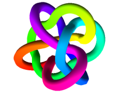

Pyknotid
========

Python (and optional Cython) modules for detecting and measuring
knotting and linking. pyknotid can analyse space-curves, i.e. sets of
points in three-dimensions, or can parse standard topological
representations of knot diagrams.

A graphical interface to some of these tools is available online at
`Knot ID <http://inclem.net/knotidentifier>`__.

pyknotid was developed as part of the Leverhulme Trust Research
Programme Grant RP2013-K-009: Scientific Properties of Complex Knots
(SPOCK), a collaboration between the University of Bristol and Durham
University in the UK. For more information, see the `SPOCK homepage
<http://www.maths.dur.ac.uk/spock/index.html/>`__.

If you use pyknotid in your research, please `cite us
<http://pyknotid.readthedocs.io/en/latest/sources/about.html#cite-us>`__.

Questions or comments are welcome, please email alexander.taylor@bristol.ac.uk.

Documentation
-------------

pyknotid is documented online at `readthedocs
<http://pyknotid.readthedocs.io/en/latest/sources/overview.html>`__.

Installation
------------

pyknotid supports both Python 2 and Python 3, you can install it with::

  $ pip install pyknotid

To try the latest development version, clone this repository and run::

  $ python setup.py install

Requirements
~~~~~~~~~~~~

If installing pyknotid without pip, the following dependencies are required:

- cython (not essential, but strongly recommended)
- numpy
- sympy
- peewee
- networkx
- planarity

Most of these are not hard requirements, but some functionality will
not be available if they are not present.

Example usage
-------------

.. code:: python

    In [1]: import pyknotid.spacecurves as sp

    In [2]: import pyknotid.make as mk

    In [3]: k = sp.Knot(mk.three_twist(num_points=100))

    In [4]: k.plot()

    In [5]: k.alexander_polynomial(-1)
    Finding crossings
    i = 0 / 97
    7 crossings found

    Simplifying: initially 14 crossings
    -> 10 crossings after 2 runs
    Out[5]: 6.9999999999999991

    In [6]: import sympy as sym

    In [7]: t = sym.var('t')

    In [8]: k.alexander_polynomial(t)
    Simplifying: initially 10 crossings
    -> 10 crossings after 1 runs
    Out[8]: 2/t - 3/t**2 + 2/t**3

    In [9]: k.octree_simplify(5)
    Run 0 of 5, 100 points remain
    Run 1 of 5, 98 points remain
    Run 2 of 5, 104 points remain
    Run 3 of 5, 92 points remain
    Run 4 of 5, 77 points remain

    Reduced to 77 points

    In [10]: k.plot()
