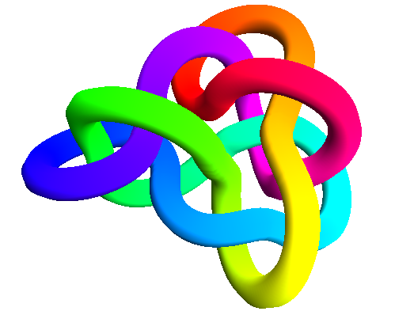

pyknotid
=======

..
   .. image:: k10_92_ideal.png
      :scale: 50%
      :alt: The knot 10_92 in an ideal conformation, visualised by pyknotid.

pyknotid is a Python module for identifying knot types and other
topological quantities. It can take as input space-curves (such as
visualised above) or standard topological notations.

See the :doc:`overview <sources/overview>` for an introduction to
pyknotid's functionality, or find specific topics in the index below.

Contents
========

.. toctree::
    :maxdepth: 2

    sources/overview
    sources/spacecurves/index
    sources/invariants
    sources/representations/index
    sources/catalogue/index
    sources/make/index
    sources/visualise
    sources/about
   

Indices and tables
==================

* :ref:`genindex`
* :ref:`search`

