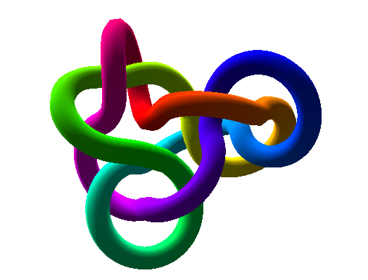

Overview
========

pyknotid is a Python module for doing calculations on knots or links,
whether specified as space-curves, or via standard topological
notations.

Visit `Knot ID <http://inclem.net/knotidentifier>`__ for an online
interface to some of these tools.

Installation
------------

You can install pyknotid via pip::

  $ pip install pyknotid

By default pyknotid will try to compile some cython modules, but if
this fails (normally because cython is not installed) it will only
print a message and continue without errors. This won't impact your
use of pyknotid except that the cython calculations would be,
especially during space-curve analysis. If you want to use the
improved speed of the cython implementations but did not initially
install them, you should uninstall pyknotid, install cython, and
reinstall pyknotid.

You can also install the pyknotid development version from github at
https://github.com/SPOCKnots/pyknotid.

Space curve analysis
--------------------

pyknotid can perform many calculations on space curves specified as a
set of points, as well as plotting the curves in three dimensions or
in projection. See the :doc:`space curve documentation
<spacecurves/index>` for more information.

Some topological calculations can only be performed for relatively
short, simple curves, but in general pyknotid can work fine even for
space-curves with many thousands of points.

Example::

  from pyknotid.make import trefoil
  from pyknotid.spacecurves import Knot

  k = Knot(trefoil())

  k.determinant()  # 3
  k.gauss_code()  # 1+a,2-a,3+a,1-a,2+a,3-a
  k.identify()  # [<Knot 3_1>]

Topological representations
---------------------------

pyknotid can accept input using several standard topological notations
including the Gauss code, planar diagram or Dowker-Thistlethwaite
notation. You can then calculate topological invariants, or even
reconstruct a 3D space curve. See the :doc:`representation
documentation <representations/index>` for more information.

Example::

  from pyknotid.representations import GaussCode, Representation

  gc = GaussCode('1+a,2-a,3+a,1-a,2+a,3-a')
  gc.simplify() # does nothing here, as no Reidemeister moves can be
                # performed to immediately simplify the curve

  # Representation is a generic topological representation providing
  # more methods
  rep = Representation(gc)
  rep.determinant()  # 3
  rep.space_curve()  # <Knot with 34 points>, a space curve with the
                     # given Gauss code on projection

Knot catalogue
--------------

pyknotid can look up knot types in a prebuilt database containing
various invariants for knots with up to 15 crossings. They can be
looked up by the knot name (e.g. ``3_1`` for the trefoil knot, ``4_1``
for the figure-eight knot etc.), or the values of different knot
invariants. See the :doc:`knot catalogue documentation
<catalogue/index>` for more information.

Example::

  from pyknotid.catalogue import get_knot, from_invariants

  k = get_knot('5_2')
  k.vassiliev_2  # 2
  k.determinant()  # 3

  k = get_knot('7_3').space_curve()  # <Knot with 83 points>, a space curve
                                     # that forms a 7_3 knot.

  knots = from_invariants(determinant=7, max_crossings=11) # [<Knot 5_2>,
                                                           #  <Knot 7_1>,
                                                           #  <Knot 9_42>,
                                                           #  <Knot K11n57>,
                                                           #  <Knot K11n96>,
                                                           #  <Knot K11n111>]
  
Example knots
-------------

pyknotid includes several functions for creating example knotted space
curves. See the :doc:`example knots documentation <make/index>` for
more details.

Example::

  from pyknotid.make import torus_knot

  k = torus_knot(p=5, q=2)
  k.identify()  # [<Knot 5_1>]

  from pyknotid.make import torus_link

  l = torus_link(p=2, q=8)  # a 2-component link
  l.linking_number()  # 8

  from pyknotid.make import figure_eight

  k = figure_eight()
  k.determinant()  # 5

  
